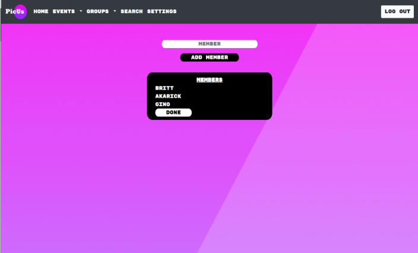
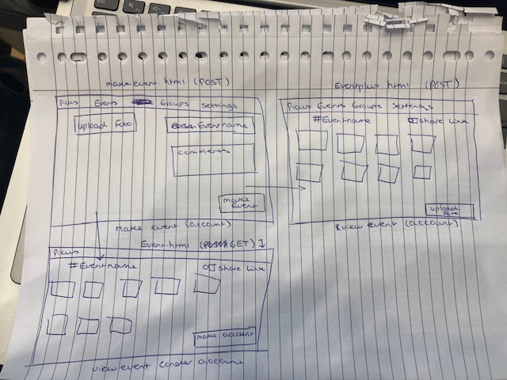

# PicUs

Rick Sunder, Gino Penasilico en Britt Roele
## Samenvatting
Wij gaan een online platform maken, waarbij er twee soorten functies zijn: een ingelogde functie en een voor iedereen beschikbare functie. Bij de ingelogde functie is het mogelijk om een evenement aan te maken om foto's te delen die voor iedereen zichtbaar zijn. Daarnaast is het mogelijk om gesloten groepen aan te maken, waarbij in groepen foto's kunnen worden gedeeld, de foto kan worden gedislikt en gelikt worden en gifjes en commentaar kan onder een foto worden gepost. Als je geen account hebt is het mogelijk om een event te bekijken en alle foto's die daar bij horen. Met de zoekfunctie kun je events op naam vinden. Door middel van een link rechtsboven in het scherm bij events kan de pagina worden gedeeld met allemaal mensen. De extra functies zoals liken, commenten en foto's uploaden wordt beschikbaar wanneer je bent ingelogd. Degene die de foto heeft gepost kan de foto verwijderen. Bij de besloten groepen is het mogelijk om leden toe te voegen, zelf uit de groep te gaan en foto's te uploaden. De nieuwste foto's verschijnen bovenaan de pagina. So Pic Us instead of them!

## Schetsen:

.png)
.png)
.png)
.png)
.png)
.png)
.png)
.png)
.png)
.png)
.png)
.png)
.png)
.png)
.png)

* Homepage
* Login
* Register
* Tijdlijn gesloten groepen
* Event aanmaken
* Home event
* event overzicht
* Groep aanmaken
* Home groep
* Leden aan gesloten groep toevoegen
* Foto's uploaden
* Zoeken
* Instellingen
* Wachtwoord veranderen
* Profielfoto toevoegen voor een groep of event

## Helpers.py
In de helpers.py staan allemaal functies waarin gegevens uit de database worden opgehaald. Als comment is er bij geschreven bij welke functie in application.py die wordt gebruikt. Daarnaast is er een functie die checkt of je bent ingelogd.

## Features
(Dikgedrukt is nodig voor het MVP)

* **Gebruikers kunnen worden toegevoegd door andere leden van de groep**
* **Je moet inloggen om een groep aan te maken**
* **Je moet een gebruiker zijn om foto’s te posten bij een evenement
* **Voor gesloten groep moet je inloggen
* I**edereen kan foto toevoegen in gesloten groep
* Degene die de foto heeft geüpload kan hem ook weer verwijderen
* Onder een foto kan er een gifje worden gepost als commentaar bij zowel de besloten groepen als de events (mits je bent ingelogd).
* Gebruikers kunnen zelf uit een groep gaan
* **Foto’s in gesloten groepen kunnen geliked worden en er kan op gereageerd worden.**

## Taakverdeling:
* Gino: login, registratie, zoekfunctie, layout, homepage (met zwevende computer) en alle opmaak
* Rick: alles dat met events te maken heeft en API gifjes
* Britt: alles dat met groepen te maken heeft

## Repository
In de algemene map staat helpers.py, application.py en de database (PicUs.db)
In templates staan al onze html bestanden. En in static staat onze css stylesheet en ons logo. Als laatste staat in de map upload alle foto's die gebruikers kunnen uploaden op onze website.

# Technisch Ontwerp
## Controllers
1. login.html (POST)
* De gebruiker moet kunnen inloggen om bij de functie in een besloten groep zitten te komen of om een event aan te maken.
2. register.html (POST)
* De gebruiker moet zich kunnen registreren, waarbij checks zijn of de gebruikersnaam al bestaat, het wachtwoord overeenkomt en of het een geldig e-mailadres is.
3. groupfeed.html (POST)(Homepage)
* Homepage als je ingelogd bent. Hierop kan je je besloten groepen zien en daar naartoe gaan.
4. makegroup.html / addgroupmember.html (POST (idk))
* Hierbij moet je een groep kunnen aanmaken en gebruikers kunnen toevoegen
5. groupview.html(https://PicUs.com/groups/desbetreffende_groep)(POST)
* Dit is de homepage van een groep waarbij je allemaal foto's kunt zien, kunt liken en disliken. Daarnaast kan je een groep verlaten en mensen toevoegen aan de groep.
6. settings.html(POST)
* Link naar je wachtwoord veranderen en je username veranderen. Daarnaast kun je meer over onze website lezen en uitloggen.
7. password.html(POST)
* Hierbij kan je je wachtwoord veranderen.
8. aboutUs.html(GET)
* Hier lees je meer informatie over onze website.
9. makeevent.html(POST)
* Hierbij kan je als je ingelogd bent een event aanmaken.
10. index.html(GET)
* De index is de homepage van onze website als je nog niet bent ingelogd. Hierbij wordt je doorverwezen naar de registratie.
11. event.html(POST/GET)
* Homepage van de event waarbij niet-gebruikers van onze website alsnog de foto's van het event kunnen zien.
12. addmembers.html(POST)
* Functie om gebruikers toe te voegen aan een groep.
13. search.html(GET/POST)
* Hierbij kun je zoeken naar een evenement.

## Views:

## Models:
* Het opzoeken van een user
* Het opzoeken van een groep
* De foto van een groep geplaatst door iemand opzoeken
* Login vereist
* Het aantal likes ophalen
* De foto's ophalen
* De profielfoto ophalen

## Framework:
* [Bootstrap navigatie bar](https://bootsnipp.com/snippets/Vm7d)
* [Eventueel bootstrap voor het liken van foto’s](https://bootsnipp.com/snippets/featured/modal-lightbox-with-likedislike)
* Bootstrap voor de opmaak van het weergaven van foto's
* Bootstrap voor de icoontjes die wij gebruiken als button
