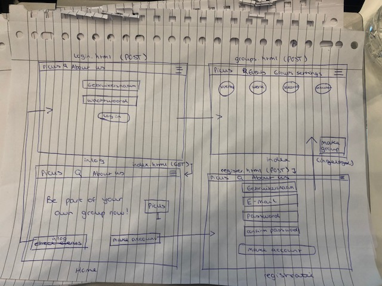

# Projectvoorstel webik
## Samenvatting
Wij gaan een online platform maken, waarbij er twee soorten functies zijn: een ingelogde functie en een voor iedereen beschikbare functie. Bij de ingelogde functie is het mogelijk om een evenement aan te maken om foto's te delen die voor iedereen zichtbaar zijn. Daarnaast is het mogelijk om gesloten groepen aan te maken, waarbij in groepen foto's kunnen worden gedeeld, gepict (liken) en gifjes worden gestuurd. Als je geen account hebt is het mogelijk om een event te bekijken en alle foto's die daar bij horen. Met de zoekfunctie kun je onder andere de top 5 evenementen vinden.

## Schetsen:

* Homepage
* Login
* Register
* Tijdlijn gesloten groepen
* Event aanmaken
* Home event
* event overzicht
* Groep aanmaken
* Home groep
* Leden aan gesloten groep toevoegen
* Foto's uploaden
* Zoeken
* Instellingen
* Wachtwoord veranderen
* Profielfoto toevoegen

## Features
(Dikgedrukt is nodig voor het MVP)

* **Gebruikers kunnen worden toegevoegd door andere leden van de groep**
* **Je moet inloggen om een groep aan te maken**
* Je moet een gebruiker zijn om foto’s te posten bij een evenement
* Voor gesloten groep moet je inloggen
* Iedereen kan foto toevoegen en verwijderen in gesloten groep
* In plaats van een foto kan er ook een gifje worden gepost bij gesloten groepen.
* Gebruikers kunnen zelf uit een groep gaan
* **Foto’s in gesloten groepen kunnen geliked worden en er kan op gereageerd worden.**
* Nieuw geregistreerde gebruikers moeten hun e-mailadres bevestigen via de mail.
* Foto’s verwijderen bij evenement als 20% disliked.

## Databronnen:
Gaan wij waarschijnlijk weinig gebruik van maken, want de foto’s die gebruikt gaan worden in onze applicatie kunnen users zelf uploaden.

## Externe componenten:
* Eventueel bootstrap voor het liken van foto’s (https://bootsnipp.com/snippets/featured/modal-lightbox-with-likedislike)

## Concurrerende bestaande websites:
* Facebook
* Instagram

## Moeilijkste delen:
* Een apart gedeelte voor de groepsaccounts en voor het persoonlijke account
* Iemand met een speciale status (admin) bepaalde rechten geven
* Het blokkeren van iemand lijkt ons lastig

# Technisch Ontwerp
## Controllers
1. login.html (POST)
* De gebruiker moet kunnen inloggen om bij de functie in een besloten groep zitten te komen of om een event aan te maken.
2. register.html (POST)
* De gebruiker moet zich kunnen registreren, waarbij checks zijn of de gebruikersnaam al bestaat, het wachtwoord overeenkomt en of het een geldig e-mailadres is.
3. groupfeed.html (POST)(Homepage)
* Homepage als je ingelogd bent. Hierop kan je je besloten groepen zien en daar naartoe gaan.
4. makegroup.html / addgroupmember.html (POST (idk))
* Hierbij moet je een groep kunnen aanmaken en gebruikers kunnen toevoegen
5. groupview.html(https://PicUs.com/groups/desbetreffende_groep)(POST)
* Dit is de homepage van een groep waarbij je allemaal foto's kunt zien, kunt liken en disliken. Daarnaast kan je een groep verlaten en mensen toevoegen aan de groep.
6. settings.html(POST)
* Link naar je wachtwoord veranderen en je username veranderen. Daarnaast kun je meer over onze website lezen en uitloggen.
7. password.html(POST)
* Hierbij kan je je wachtwoord veranderen.
8. aboutUs.html(GET)
* Hier lees je meer informatie over onze website.
9. makeevent.html(POST)
* Hierbij kan je als je ingelogd bent een event aanmaken.
10. index.html(GET)
* De index is de homepage van onze website als je nog niet bent ingelogd. Hierbij wordt je doorverwezen naar de registratie.
11. event.html(POST/GET)
* Homepage van de event waarbij niet-gebruikers van onze website alsnog de foto's van het event kunnen zien.
12. addmembers.html(POST)
* Functie om gebruikers toe te voegen aan een groep.
13. search.html(GET/POST)
* Hierbij kun je zoeken naar een evenement.

## Views:

## Models:
* Het opzoeken van een user
* Het opzoeken van een groep
* De foto van een groep geplaatst door iemand opzoeken
* Login vereist
* Het aantal likes ophalen
* De foto's ophalen
* De profielfoto ophalen

## Framework:
* [Bootstrap navigatie bar](https://bootsnipp.com/snippets/Vm7d)
* [Eventueel bootstrap voor het liken van foto’s](https://bootsnipp.com/snippets/featured/modal-lightbox-with-likedislike)

## Eventuele extra links:
* gebruikersnaam.html(POST)
* mijn-fotos.html(POST)
* vrienden.html(POST)
