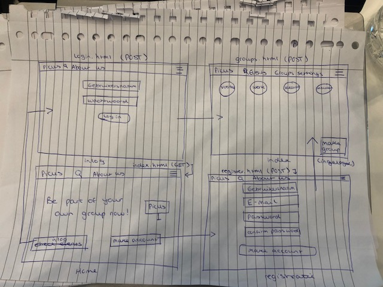
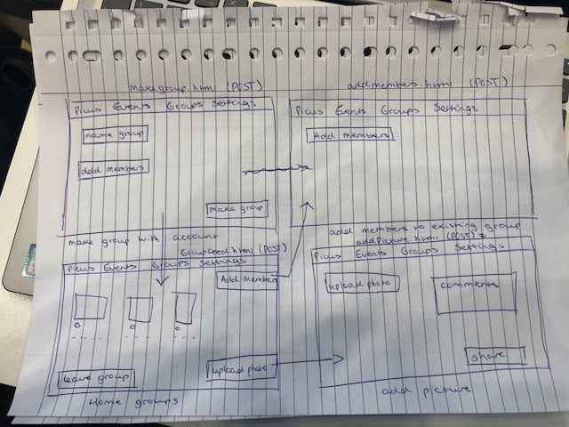
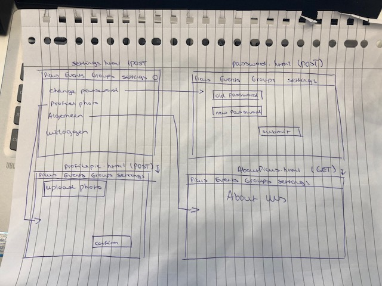
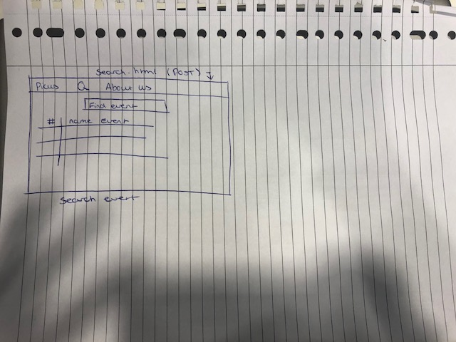

# Technisch Ontwerp
## Controllers
* login.html (POST)
** De gebruiker moet kunnen inloggen om bij de functie in een besloten groep zitten te komen of om een event aan te maken.
* register.html (POST)
** De gebruiker moet zich kunnen registreren, waarbij checks zijn of de gebruikersnaam al bestaat, het wachtwoord overeenkomt en of het een geldig e-mailadres is.
* groupfeed.html (POST)(Homepage)
** Homepage als je ingelogd bent. Hierop kan je je besloten groepen zien en daar naartoe gaan.
* makegroup.html / addgroupmember.html (POST (idk))
** Hierbij moet je een groep kunnen aanmaken en gebruikers kunnen toevoegen
* groupview.html(https://PicUs.com/groups/desbetreffende_groep)(POST)
** Dit is de homepage van een groep waarbij je allemaal foto's kunt zien, kunt liken en disliken. Daarnaast kan je een groep verlaten en mensen toevoegen aan de groep.
* settings.html(POST)
** Link naar je wachtwoord veranderen en je username veranderen. Daarnaast kun je meer over onze website lezen en uitloggen.
* password.html(POST)
** Hierbij kan je je wachtwoord veranderen.
* aboutUs.html(GET)
** Hier lees je meer informatie over onze website.
* makeevent.html(POST)
** Hierbij kan je als je ingelogd bent een event aanmaken.
* index.html(GET)
** De index is de homepage van onze website als je nog niet bent ingelogd. Hierbij wordt je doorverwezen naar de registratie.
* event.html(POST/GET)
** Homepage van de event waarbij niet-gebruikers van onze website alsnog de foto's van het event kunnen zien.
* addmembers.html(POST)
** Functie om gebruikers toe te voegen aan een groep.
* search.html(GET/POST)
** Hierbij kun je zoeken naar een evenement.

## Views:

## Models:
* Pop-up bij verkeerde gegevens - Gebruiker wordt teruggestuurd naar de pagina met een melding dat bijvoorbeeld de inloggevens niet kloppen door middel van een pop-up
* Like-functie - Automatische functie die het aantal likes weergeeft onder een foto

## Framework:
* [Bootstrap navigatie bar](https://bootsnipp.com/snippets/Vm7d)
* [Eventueel bootstrap voor het liken van foto’s](https://bootsnipp.com/snippets/featured/modal-lightbox-with-likedislike)

## Eventuele extra links:
* gebruikersnaam.html(POST)
* mijn-fotos.html(POST)
* vrienden.html(POST)
